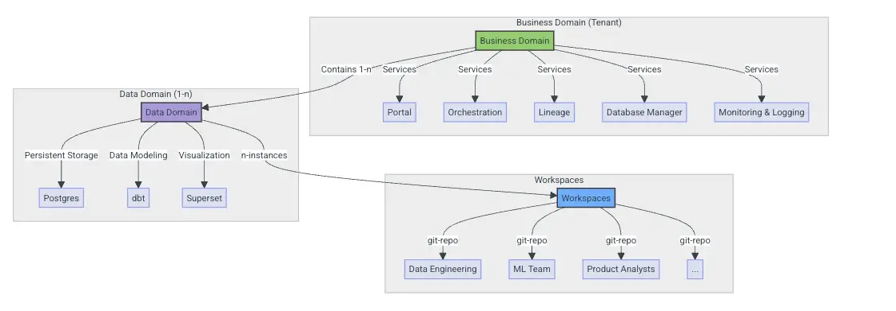
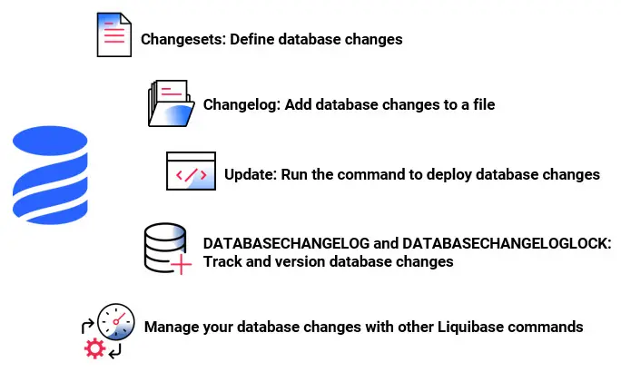

# Data Platform Deployment Best Practices
This guide outlines best practices for deploying open data stacks on Kubernetes using GitOps principles, focusing on efficient patterns that work well with modern DevOps workflows.

This provides a guideline and best practices for transitioning from traditional deployment methods. to a DevOps workflow.

The examples shown and the acompanied git-repo [ssp-data/deployment-blueprint-gitops](https://github.com/ssp-data/deployment-blueprint-gitops) is not meant to work, but rather as a guideline to see what such a deployment can and should involve, depending on the depths of the deployment. 

Key principles are:
1. **Separation of Concerns**: Clear boundaries between infrastructure, platform services (if you want to go that deep), and applications such as business logic in data pipelines etc.
2. **GitOps-Driven**: Everything defined as code, with Git as the single source of truth
3. **Hierarchical Configuration**: Shared configurations at higher levels, specific overrides at lower levels
4. **Secret Management**: Secure handling of sensitive information using SOPS or sealed secrets
5. **Automation**: CI/CD pipelines for validation and deployment
6. **Observability**: Built-in monitoring and alerting for all components
7. **Multi-tenancy**: Isolation between different tenants/domains with clear access boundaries
8. **Release Management**: Consistent, repeatable deployment processes with clear versioning

## Recommended GitOps Stack
There are several [GitOps](https://www.ssp.sh/brian/gitops) tools, most notable are [ArgoCD](https://argo-cd.readthedocs.io/en/stable/0, [Flux](https://fluxcd.io/) or [Terraform](https://developer.hashicorp.com/terraform). This example uses Flux as I have used that at my previous work, but ArgoCD is defenitely better if you like visual web interface. Flux is more basics.

- **GitOps Controller**: Flux for continuous delivery on Azure/AWS
	- This means, changes are made through `git commits` to a deployment-repository, and Flux (or representative tool) will build a new release and deploy on dev/test/prod (depending where you made your changes)
- **Package Management**: Helm Charts for application deployment
	- Most OSS tools provide [Helm Charts](https://helm.sh/) that can be used to deploy on Kubernetes or anywhere. Therefore these can be integrated in the deployment scripts.
- **Secret Management**: [SOPS](https://fluxcd.io/flux/guides/mozilla-sops/) with GitOps integration
- **Database Migration**: [Liquibase](https://www.ssp.sh/brain/liquibase/) can handle database schema changes programaitcal. Meaning you define alter changes in a specific form (called `changesets`) and instead of manually creating the DDL statement from one release to the next, or from a major to the next major manually, liquid base can handle these. See example [[#Database Migration]]
- **CI/CD**: GitHub Actions or similar for validation and deployment
	- On Azure the equivalent of GitHub Actions in Azure DevOps is [Azure Pipelines](https://azure.microsoft.com/en-us/products/devops/pipelines). 
- **Infrastructure Management**: Platform-specific tools (Azure ARM, AWS CloudFormation) for resources that must be created before Kubernetes

## Folder Structure

This is a extensive, but high-level example how such a folder structure could look like.

Notable is that you have a folder of each **environment** (dev/test/prod) and you overwrite configurations or versions in that specific environment configs. E.g. in prod you might have a lower version than on dev where you test the latest version.


```
/data-platform-gitops/
├── clusters/                           # One directory per cluster
│   ├── dev/                            # Dev environment
│   │   ├── flux-system/                # Flux bootstrap configuration 
│   │   └── cluster-config.yaml         # Cluster-specific config pointing to apps
│   └── prod/                           # Production environment
│       ├── flux-system/
│       └── cluster-config.yaml
├── infrastructure/                     # Infrastructure components
│   ├── base/                           # Common infrastructure components
│   │   ├── observability/              # Monitoring, logging, tracing
│   │   ├── networking/                 # Ingress controllers, cert-manager, etc.
│   │   └── storage/                    # Storage classes, persistent volumes
│   └── overlays/                       # Environment-specific overlays
│       ├── dev/                        # Dev-specific infrastructure
│       └── prod/                       # Production-specific infrastructure
├── platform/                           # Platform services 
│   ├── base/                           # Base definitions for data platform components
│   │   ├── kestra/                     # Kestra infra-configuration
│   │   ├── superset/                   # Superset configuration
│   │   ├── dlt/                        # dlt configuration
│   │   ├── liquibase/                  # Database migration configuration
│   │   └── common/                     # Shared configurations
│   └── overlays/                       # Environment-specific overlays
│       ├── dev/                        # Dev environment configuration
│       └── prod/                       # Production environment configuration
├── domains/                            # Business/Data domain configurations
│   ├── finance/                        # Finance domain
│   │   ├── base/                       # Base configuration
│   │   └── overlays/                   # Environment-specific overrides
│   │       ├── dev/
│   │       └── prod/
│   └── marketing/                      # another domain like finance
└── .github/                            # CI/CD workflow definitions
    └── workflows/                      # GitHub Actions workflow files
        ├── validate.yaml               # Validation workflow
        ├── release.yaml                # Release workflow
        └── deploy.yaml                 # Deployment workflow
```

> [!note] Tenant
> 
> Depending on if you have multiple Tenant, you might either have multiple devops repos like this for each tenant, or integrate tenants into the folder structure.


### Workspaces
Remember, above is the infrastructure part, e.g. Kestra or dlt needed CPU's, webendpoint where you can reach the web UI, etc.

But the actual pipeline code is usually separated into a dedicated workspace
```
├── pipelines/                          # Data pipeline definitions
│   ├── <pipeline-name>.yml             # Kestra workflow definition files
│   ├── dlt/                            # Data integration scripts with dlt
│   │   └── <source-name>-<dest>.py     # Source-specific dlt scripts
│   └── README.md                       # Pipeline documentation
```

In this example we use:
- **Data Integration**: dlt for reliable data loading
- **Workflow Orchestration**: Kestra for pipeline orchestration

#### Concrete example how we implemented Workspaces in HelloDATA-BE
This is a real life example of how to integrate workspaces, a workspace different teams like ML Team, product analyst or data engineers might use for their pipelines or domain specific implementation.

These are different from infrastructure and each time mostly use a different set of libraries, e.g. data scientist experiment with Seaborn, and other libraries that have data scientist alorithms where as data engineers use pandas, numpy, etc to do tabluar data manipulations on data.

Example of the structure of above HelloDATA-BE Example, where we have different tenants with the one portal and orchestration, but different data domains to segregate data (postgres) independently, and each data domain has different workspaces:



See more on:
- [Documentation for Workspaces](https://kanton-bern.github.io/hellodata-be/concepts/workspaces/)
- [GitHub starter workspace repo](https://github.com/bedag/hellodata-be-workspace-starter/tree/main)
- [kanton-bern/hellodata-be](https://github.com/kanton-bern/hellodata-be): The Open-Source Enterprise Data Platform in a single Portal
## Deployment Workflow

Typical workflow of deployment includes and involves:
1. **Cluster Provisioning**: Set up a Kubernetes cluster on Azure/AWS (can be done manually or automated)
2. **GitOps Bootstrap**: Install and configure Flux/ArgoCD/etc. on the cluster
3. **Platform Deployment**: Deploy infrastructure components followed by platform services
4. **Tenant Provisioning**: Create tenant isolation boundaries
5. **Domain Configuration**: Apply business/data domain configurations within tenant boundaries
6. **Workspace/pipeline Deployment**: Deploy data pipelines within their domains

## Best Practices
Some best practices used for deployment and release management.
### Cluster Management
- Use managed Kubernetes services (AKS on Azure, EKS on AWS) if you don't have e dedicated DevOps or operations team
- Configure node pools for different workload types
- Implement proper network policies
- Use private clusters where possible
- Regularly update Kubernetes versions

### Configuration Management
- Follow the ["base/overlay" pattern](https://kubernetes.io/docs/tasks/manage-kubernetes-objects/kustomization/#bases-and-overlays) with [Kustomize](https://kubernetes.io/docs/tasks/manage-kubernetes-objects/kustomization/)
- Use only one String substitution, either from [Kustomize](https://dev.to/zenika/kubernetes-a-convenient-variable-substitution-mechanism-for-kustomize-lhm), or [Flux substitutions](https://fluxcd.io/flux/components/kustomize/kustomizations/#post-build-substitution-of-numbers-and-booleans)
	- Flux supports Kustomize substitution see [docs](https://fluxcd.io/flux/components/kustomize/kustomizations/) and [post-build substitution](https://fluxcd.io/flux/components/kustomize/kustomizations/#post-build-variable-substitution)
- Use and integrate existing HelmReleases for application deployment (e.g. Airflow, or Kestra, or Prometheus usually provide these in their open source repo, or sometimes need to ask and search slack and community resources)
- Implement hierarchical configuration (`cluster → environment → domain`)
- Keep environment-specific values in overlay directories
### Secret Management
- Encrypt secrets using [SOPS](https://fluxcd.io/flux/guides/mozilla-sops/) with age or [PGP keys](https://fluxcd.io/flux/guides/mozilla-sops/#generate-a-gpg-key)
- Store encrypted secrets in Git
- Configure Flux to decrypt secrets automatically
- Organize secrets hierarchically by environment and domain
- Use external secret stores (Azure KeyVault, AWS Secrets Manager, [Vault (HashiCorp)](https://developer.hashicorp.com/vault) for production

### Multi-tenancy
- Implement namespace isolation between tenants
- Use Kubernetes RBAC to control access rights
- Apply network policies to restrict cross-tenant communication
- Implement resource quotas for fair resource sharing
- Consider tenant-specific persistent volumes for data isolation

### Database Migration
- Use mentioned Liquibase for database schema management
- Store migration scripts in version control
- Implement CI/CD pipelines for database validation
- Run migrations as Kubernetes Jobs before application deployment
- Track migration history in a dedicated schema

A concrete example in  `domains/finance/overlays/dev/migrations/changelogs/` .
#### Example
There some links and examples below.
- General [Liquibase.com](https://www.liquibase.com/ci-cd) - Liquibase

- Workflow: [Introduction to Liquibase](https://docs.liquibase.com/concepts/introduction-to-liquibase.html)
	- Example of rename a column: [renameColumn](https://docs.liquibase.com/change-types/rename-column.html#sql_example)
	- more examples on [Liquibase Open Source Workflows](https://docs.liquibase.com/workflows/liquibase-community/home.html)
- data change - [loadUpdateData](https://docs.liquibase.com/change-types/load-update-data.html)
	- this function can even run and load data from source and MERGE if data existis, see example in above link
	- Example of [renaming a Column](https://docs.liquibase.com/change-types/rename-column.html)
### Release Management

- Implement [Semantic Versioning](https://semver.org/) for all components
- Use tags to mark stable releases
- Implement GitOps-based promotion between environments
- Consider [blue/green or canary deployment strategies](https://octopus.com/devops/software-deployments/blue-green-vs-canary-deployments/)
- Separate the release process from deployment process
#### Semantic Versioning
Semantic versioning is one of the **most common methods** of numbering software versions. This method uses three numbers for each software version, in Major.Minor.Patch sequence. When a major, minor, or patch update is made, the corresponding number is increased.

Versioning like: `X.Y.Z-A.B`

- X: Major
- Y: Minor
- Z: Patch
- A: Development Stage [alpha, beta, Release candidate RC, release, post-release]
- B: Sequence of A

### CI/CD Pipeline
In software engineering, CI/CD or CICD is the combined practices of continuous integration and continuous delivery or, less often, continuous deployment. They are sometimes referred to collectively as continuous development or continuous software development.

This is important for data projects as it's hard and expensive to debug errors in production. Therefore the more bugs we can detect ahead of runtime with a extensive CI/CD pipeline, the better. Usually this is also strongly dependent on a **balanced test data set**. It's good to take production data set and shrink it to a sensible size (< 1 GB) and anonymize data that is sensitive to have a good testset.
#### Continuous Delivery
These are typical automation a CD would contain for data projects:

- Build and push Docker images to internal or [public](https://hub.docker.com/) registry
- Update Helm chart values with new image versions
- Create Git tag for the release
- Generate release notes
- Deploy to development environment
- Run automated integration tests with above mentioned test data sets. Best to run **end-to-end integration test** that run an extract based on a test data set, transforms the ETL logic and has some test SQL statements to count rows and some aggregation queries.
- Promote to higher environments when testing on DEV is succeeded and approved

#### Continuous Integration
These are less important for data projects and more advanced features you could add to your CI:
- Validate Kubernetes manifests
- Lint YAML files
- Test Helm chart rendering
- Validate Kustomize overlays
- Run static analysis on Dockerfiles
- Validate database migrations
### GitOps Deployment with Flux

- Use Flux (or others) for automated deployments
- Define dependencies between Kustomizations
- Implement proper source reconciliation
- Use GitOps for promoting between environments
- Implement notification controllers for alerts
- Use image automation for automatic updates
- Leverage Flux's support for Helm, Kustomize, and raw manifests

### Monitoring and Alerting
- Deploy observability stack (Prometheus, Grafana, Loki)
- Define SLOs/SLIs for critical services
- Implement alerts for SLO violations
- Create dashboards for key metrics
- Track costs and resource utilization

## Data Pipeline Development
Adding a new data pipeline typically involves:

1. **Create dlt Integration Script**: Develop a Python script using dlt to extract and load data
2. **Define Destination Schema**: Configure how data should be mapped to the destination
3. **Create Kestra Workflow**: Define a workflow to orchestrate the data pipeline execution
4. **Configure Secrets**: Set up secure access to source and destination systems
5. **Deploy and Monitor**: Deploy the pipeline and monitor its execution


## Azure-Specific Best Practices
When deploying on Azure, consider these additional best practices:

1. **Azure Container Registry (ACR)**:
   - Use ACR for storing Docker images
   - Integrate ACR with AKS for streamlined image pulling
   - Implement image scanning for security
1. **Azure Key Vault**:
   - Store sensitive credentials in Azure Key Vault
   - Use the CSI Secret Store Driver to mount secrets
   - Rotate credentials regularly
1. **Azure Monitor**:
   - Configure Log Analytics for centralized logging
   - Set up Application Insights for application monitoring
   - Create custom dashboards for visibility
1. **Azure Networking**:
   - Use Private Link for secure service connections
   - Implement proper network security groups
   - Consider Azure Firewall for enhanced security
1. **Azure Identity**:
   - Use Azure AD for authentication
   - Implement proper RBAC for all resources
   - Use Managed Identities for service authentication
## Migrating from Traditional to GitOps
For organizations transitioning from traditional deployment methods to GitOps:

1. **Start with Infrastructure as Code**: Define all infrastructure in code
2. **Containerize Applications**: Move applications to containers
3. **Implement CI/CD**: Set up automated build and test pipelines
4. **Adopt Kubernetes**: Deploy containerized applications to Kubernetes
5. **Implement GitOps**: Use Flux (or ArgoCD, etc.) to manage deployments

## Simplified GitOps for Smaller Teams
For smaller teams or simpler projects, consider this streamlined approach:

1. **Flatten Directory Structure**: Reduce nesting levels
2. **Simplify Multi-tenancy**: Use namespaces without a tenant operator
3. **Consolidate Applications**: Package related services together
4. **Use Managed Services**: Leverage cloud provider managed services where possible
5. **Start with Core Components**: Begin with essential services and expand gradually


## Security Considerations
Advanced security practices to implement as your deployment matures:

- **Cluster Security**: Enable private API endpoints, implement network policies, and enforce pod security standards
- **Application Security**: Scan container images, use non-root users, and apply least privilege principles
- **Data Security**: Encrypt data at rest/transit, implement proper authentication/authorization, and manage secrets securely
- **Compliance**: Document security controls, implement audit logging, and regularly validate compliance requirements
## Security Considerations
These are advanced use-cases that takes a lot of time, but getting increasingly important if you use many different libraries. Some default vulnerability tests are already out of the box on GitHub and other platforms. But for the completes here some important pointers for security:

-  **Cluster Security**:
	- Enable private API server endpoints
	- Use network policies to restrict pod communication
	- Implement pod security policies/standards
- **Application Security**:
	- Scan container images for vulnerabilities
	- Use non-root users in containers
	- Implement least privilege principles
